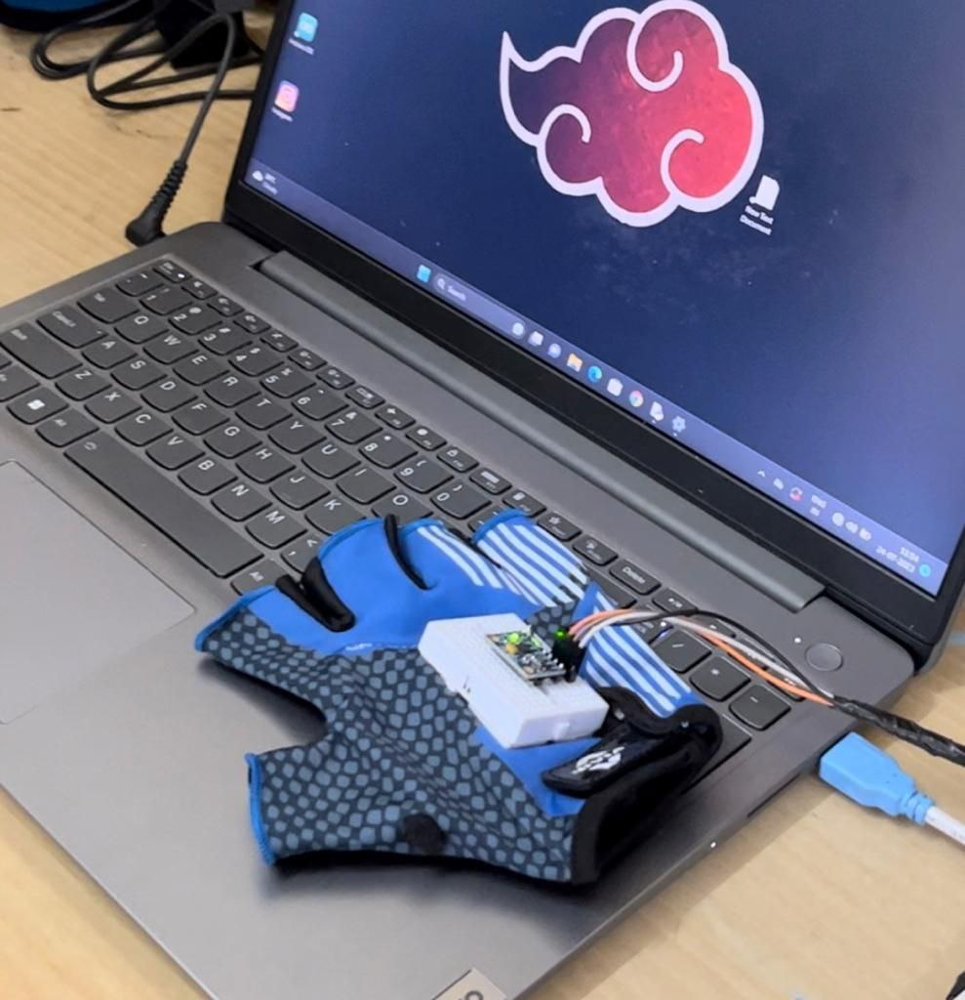

# Vader-Gloves 
### Gaming Gloves with Arduino Uno and MPU6050 Triple Axis Sensor

Welcome to the Gaming Gloves project! In this project, we'll be creating a pair of gaming gloves using an Arduino Uno board and an MPU6050 triple axis sensor. These gloves will enable you to interact with games and applications by sensing your hand movements and gestures.

## Table of Contents
- [Introduction](#introduction)
- [Requirements](#requirements)
- [Hardware Setup](#hardware-setup)
- [Software Setup](#software-setup)
- [Usage](#usage)
- [Contributing](#contributing)
- [License](#license)

## Introduction
Gaming gloves enhance the gaming experience by adding a new level of interactivity. The MPU6050 triple axis sensor will be used to detect hand movements, such as tilting, rotation, and acceleration. This data will be processed by the Arduino Uno, allowing you to map specific gestures to in-game actions or application controls.

## Requirements
To build the gaming gloves, you'll need the following components:
- Arduino Uno board or any other boards like nodeMCU etc..
- MPU6050 triple axis sensor module
- A pair of gloves (preferably fingerless)
- Breadboard and jumper wires
- USB cable for Arduino Uno
- Vibraton motors(4) for Haptic feedback

## Hardware Setup
1. Connect the MPU6050 sensor to the Arduino Uno using jumper wires. Connect the VCC and GND pins of the sensor to 5V and GND pins on the Arduino board, respectively.
2. Connect the SDA pin of the sensor to the A4 pin on the Arduino.
3. Connect the SCL pin of the sensor to the A5 pin on the Arduino.
4. Connect the Vibration Motors(for 'w' key positive pin of Vibation Motor to pin 2 of ardunio,for 's' key positive pin of Vibation Motor to pin 4 of ardunio,for 'a' key positive pin of Vibation Motor to pin 7 of ardunio and for 'd' key positive pin of Vibation Motor to pin 12 of ardunio and connect the negative pins of the Vibartion Motors to a common ground pin ) 
6. Secure the MPU6050 sensor on the glove. Make sure it can accurately detect hand movements.

## Software Setup
1. Install the Arduino IDE on your computer if you haven't already.
2. Connect the Arduino Uno board to your computer using the USB cable.
3. Open the Arduino IDE and go to **Tools > Board**. Select "Arduino Uno."
4. Go to **Tools > Port** and choose the appropriate port for your Arduino board.
5. Download the necessary libraries (MPU6050_tockn) for MPU6050 sensor integration. You can find them on GitHub or the Arduino Library Manager.
6. Load the code provided in the [gaming_gloves.ino](gaming_gloves.ino) file into the Arduino IDE.
7. Upload the code to your Arduino Uno board.

## Usage
1. Wear the gaming gloves and power on the Arduino Uno.
2. Calibrate the MPU6050 sensor by placing your hand in a comfortable, neutral position and pressing a button (you can customize this in the code).
3. open the serial monitor in Arduino IDE to check if the inputs are recieved
4. close the IDE
5. Run the Python Script [port1.py](port1.py) check if its working on games
6. if not for Dx11 game run The python Script [port2v1.py](port2v1.py) by placing the [directkey.py](directkey.py)file and the `port2v1.py file on the same folder` 
7. Once calibrated, you can start using the gloves to interact with games or applications. For example, you can tilt your hand to move a character, rotate your hand to control camera angles, or make gestures to trigger specific actions.

## Contributing
We welcome contributions to enhance the gaming gloves project. If you have ideas for improvements or new features, feel free to fork the repository, make your changes, and submit a pull request.

## License
This project is licensed under the [MIT License](LICENSE), which means you are free to modify and use the code for personal and commercial purposes. However, make sure to include the original license file in your project.

Enjoy your gaming gloves, and have fun exploring new ways to interact with your favorite games and applications! If you have any questions or need assistance, feel free to reach out to us. Happy gaming!
